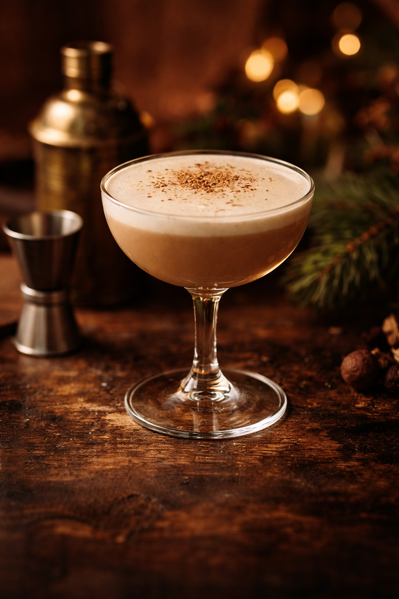

# Bourbon Midnight Flip

**Style:**
**Glass:** Coupe  
**Ice:** None  
**Garnish:** Fresh grated nutmeg

---

## Ingredients
- 1.5 oz bourbon  
- 0.75 oz coffee liqueur  
- 0.75 oz heavy cream  
- 0.25 oz demerara syrup or maple syrup  
- 1 whole egg  
- 1 dash Angostura bitters

---

## Method
1. Add all ingredients to a shaker **without ice** and dry shake vigorously to fully emulsify the egg.
2. Add ice and shake hard for 10–12 seconds.
3. Double-strain into a chilled coupe glass.
4. Garnish with freshly grated nutmeg.

---

## Notes
Rich, velvety, and festive. The egg provides luxurious texture, while bourbon warmth and coffee liqueur depth make this an ideal winter dessert cocktail.

*Inventory tag:* bourbon, coffee liqueur, cream, egg, flip

